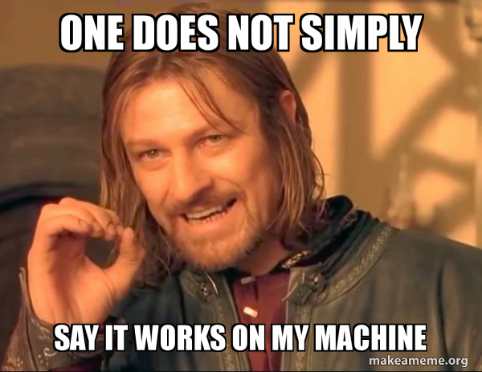
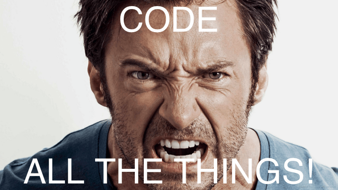
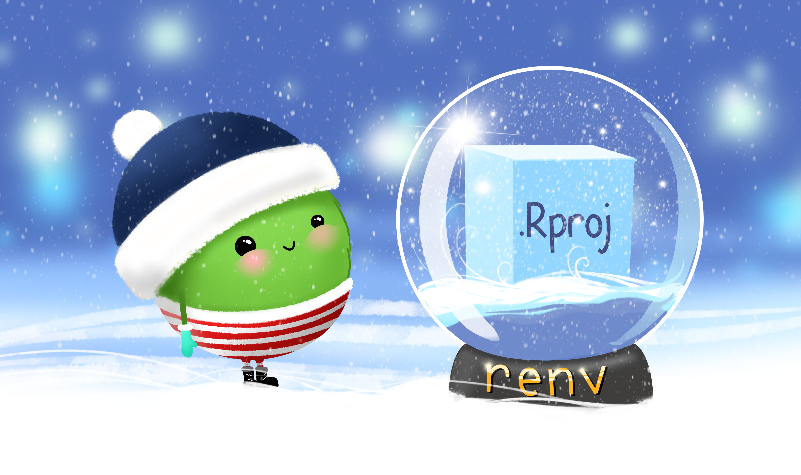

```{r}
#| label: setup
#| include: false
options(htmltools.dir.version = FALSE)
knitr::opts_chunk$set(
  fig.width = 7,
  fig.height = 5,
  fig.align = "center",
  out.width = "100%"
)

library(countdown)

# Load required packages for QR code generation
if (!require("qrcode")) install.packages("qrcode")
library(qrcode)

if (!require("here")) install.packages("here")
library(here)
here::i_am("Presentation/presentation.qmd")

include_local_figure <- function(data_source) {
  knitr::include_graphics(
    path = here::here(
      "Presentation/Materials",
      data_source
    ),
    error = TRUE
  )
}

source(
  here::here("R/set_r_theme.R")
)

# Dynamic project name generation using {here}
project_name <-
  basename(here::here())

# Create a cleaner display name for the lecture
display_name <-
  gsub("SSoQE-", "", project_name) |>
  gsub("_", " ", x = _) |>
  tools::toTitleCase()

# Create dynamic URLs
github_url <-
  paste0(
    "https://github.com/SSoQE/",
    project_name
  )

slides_url <-
  paste0(
    "https://ssoqe.github.io/",
    project_name, "/"
  )
```

# {.title}

<br>

:::: {.columns}

::: {.column width="80%"}
:::

::: {.column width="20%"}

```{r}
#| label: ssoqe-logo-title
include_local_figure("Logos/SSOQE_logo3.png")
```

:::

::::

:::: {.r-hstack}
::: {data-id="box1" style="background: `r ssoqe_cols['black']`; width: 135px; height: 15px; margin: 0px;"}
:::

::: {data-id="box2" style="background: `r ssoqe_cols['cambridge_blue']`; width: 405px; height: 15px; margin: 0px;"}
:::

::: {data-id="box3" style="background: `r ssoqe_cols['persian_green']`; width: 225px; height: 15px; margin: 0px;"}
:::

::: {data-id="box4" style="background: `r ssoqe_cols['satin_sheen_gold']`; width: 135px; height: 15px; margin: 0px;"}
:::
::::

::: {.text-color-white .text-font-heading .text-size-heading2 .text-bold}
`r display_name`
:::

:::: {.columns}

::: {.column width="20%"}

:::

::: {.column width="80%" .text-right .text-size-body}
[👤](https://ondrejmottl.github.io/) Ondřej Mottl

[Science School of Quantitative Ecology 2026]{.text-color-black}

[bit.ly/SSoQE](https://bit.ly/SSoQE){.text-color-black}
:::

::::


## [This presentation]{.text-bold .r-fit-text} {.title}

:::: {.columns}

::: {.column width="70%"}
::: {.r-fit-text}
[😸 Code on GitHub](`r github_url`)

[🖥️ Slides](`r slides_url`)

[](https://opensource.org/licenses/MIT)
:::
:::

::: {.column width="30%"}
```{r}
#| label: qr_slides
qr_slides <-
  qrcode::qr_code(
    slides_url,
    ecl = "H"
  )

qrcode::generate_svg(
  qrcode = qr_slides,
  filename = here::here("Presentation/Materials/QR/qr_slides.svg"),
  foreground = ssoqe_cols["white"],
  background = ssoqe_cols["midnight_green"]
)

include_local_figure("QR/qr_slides.svg")
```
:::

::::

## Reproducibility? 🤔

<br>

:::: {.columns}

::: {.column width="60%"}

{fig-alt="One does not simply say it works on my machine meme" width="100%"}

:::

::: {.column width="40%"}

<br>
<br>

::: {.blockquote .text-center}

I reproduced the result on [my computer]{.text-highlight-cambridgeBlue}. Is the work [**reproducible**]{.text-highlight-persianGreen}?

:::

:::

::::

::: footer
[Meme image from makeameme.org](https://media.makeameme.org/created/one-does-not-50b8331726)
:::

## What we'll cover today

:::: {.columns}

::: {.column width="46%" .incremental}

### 🎯 **Main topics**

- Hidden session state
- Immutable data workflows
- R Projects
- Portable paths and package libraries
- The restart-and-rerun test

:::

::: {.column width="54%" .incremental}

### ✅ **By the end, you'll be able to:**

- Start fresh and recreate objects from code
- Preserve inputs and make transformations explicit
- Give every analysis a clear project home
- Use `{here}` and explain `{renv}`
- Hand the project to somebody else and rerun it

:::

::::

## Our mini-project 🌲

<br>

Twelve synthetic forest plots contain:

- forest type;
- tree count 
- mean diameter;
- species richness;
- canopy cover

<br>

::: {.fragment}
Our goal is a small summary that another researcher can reproduce.
:::


## How we will repair it 🧰

<br>

::: {.incremental}

- Define the reproducibility problem;
- Remove hidden state;
- Protect the evidence;
- Give the analysis a home;
- Make files and software portable;
- Assemble and run the complete workflow;
- Let somebody else prove it.

:::

# [REMOVE HIDDEN STATE]{.bold .r-fit-text} {.title}

## A suspicious success 🤨

<br>

let's call

```r
forest_summary |>
  dplyr::arrange(
    dplyr::desc(mean_richness)
  )
```

<br>

::: {.fragment}
It works on my laptop. Is that enough?
:::

<br>

::: {.fragment .blockquote}
Where did `forest_summary` come from?
:::

<br>

## The Console 🖥️

<br>

The Console runs [one command at a time]{.text-highlight-cambridgeBlue}.

```r
forest_raw <- readr::read_csv(input_path)
```

::: {.fragment}
R follows the instruction and creates an object called `forest_raw`.
:::

<br>

::: {.fragment}
```r
nrow(forest_raw)
```

Now the next command can use that object. ✨
:::

::: {.fragment .blockquote}
The Console is brilliant for a quick experiment—but it remembers the result only inside the current session.
:::

## Memory management 🗑️

<br>

:::: {.columns}

::: {.column width="52%"}

### 👀 **Environment panel**

::: {.incremental}

- **Objects:** what currently exists
- **Types:** data frames, vectors, functions
- **Size:** how much memory objects use

:::

::: {.fragment}
[It shows the current state—not how that state was created.]{.text-highlight-cambridgeBlue}
:::

:::

::: {.column width="48%"}

::: {.fragment}
### 🧹 **Remove an object**

```r
rm(forest_raw)
```
:::

::: {.fragment}
- `rm()` clears an object from memory.
:::

:::

::::

## Restarting the session 🔄

<br>

Restarting R ends the current R process and starts a [fresh one]{.text-highlight-persianGreen}.

::: {.incremental}

- objects in the Global Environment disappear;
- attached packages are detached;
- unrecorded steps stop helping the analysis;
- RStudio and the project remain open.

:::

::: {.fragment .text-center}
### In RStudio: `Ctrl + Shift + F10` ⌨️
:::

::: {.fragment .blockquote}
Restarting is not an emergency repair. It is a routine reproducibility test.
:::

## Which one survives a restart? 🤔

<br>
<br>

:::: {.columns}

::: {.column width="48%"}

```r
mean(
  forest_raw$species_richness,
  na.rm = TRUE
)
```

<br>
<br>

::: {.fragment .text-center}
❌ `forest_raw` does not exist.
:::

:::

::: {.column width="48%"}

::: {.fragment}
```r
forest_raw <- readr::read_csv(input_path)

mean(
  forest_raw$species_richness,
  na.rm = TRUE
)
```
:::

<br>

::: {.fragment .text-center}
✅ The object is recreated first.
:::

:::

::::

## `.RData`: zombie memory 🧟

<br>

:::: {.columns}

::: {.column width="45%"}

### 💾 **What it does**

::: {.incremental}

- saves workspace objects at the end of a session;
- can restore them automatically next time;
- "resurrects" objects without the code that created them.

:::

<br>

::: {.fragment .blockquote}
**NEVER** rely on `.RData`.
:::

:::

::: {.column width="3%"}
:::

::: {.column width="49%"}

::: {.fragment}
### **Turn it off in RStudio** 🚫

**Tools → Global Options → General**

1. Uncheck **Restore .RData into workspace**.
2. Set **Save workspace to .RData on exit** to **Never**.
:::

::: {.fragment}
A clean session should fail loudly when the script forgot a step. 📣
:::

:::

::::

## Scripts: the project's memory 🧠

<br>

::: {.fragment}
Put every decision needed for the result in a script:

```r
# R/analysis.R  
forest_raw <- 
  readr::read_csv(
    here::here("Data", "Input", "forest_plots.csv"),
    show_col_types = FALSE
  )

estimate_diversity(forest_raw)
```
:::

<br>

::: {.fragment .blockquote}
If a command matters, it belongs in the script.
:::

## [Note on practical exercises]{.r-fit-text .text-color-dartmouth-green} {.bg-white}

{fig-alt="Monkey see, monkey do illustration signalling that students first watch a demonstration and then try it themselves" width="58%"}

::: footer
[Image by adiasarahma](https://www.deviantart.com/adiasarahma/)
:::

## [Your turn]{.text-size-heading2} {.exercise .text-center}

<br>

::: {.blockquote}

With a partner:

1. Create a new object in the Console;
2. Chech the Environment panel;
3. restart R session (CTRL + Shift + F10);
4. Check the Environment panel again.
5. (Optional) Dissable automatic saving of .RData.

:::


# [GIVE THE ANALYSIS A HOME]{.bold .r-fit-text} {.title}

## Project based workflow 

```{r}
#| label: project_compendium
include_local_figure("Scriberia/ResearchCompendium.jpg")
```

::: footer
[This image was created by Scriberia for The Turing Way community and is used under a CC-BY licence](https://zenodo.org/doi/10.5281/zenodo.3332807)
:::
:::{.footer}

:::

## RStudio Projects

<br>

### 📁 **One analysis, one home**

:::: {.columns}

::: {.column width="48%"}

{fig-alt="RStudio interface showing the project-oriented working environment" width="100%"}

:::

::: {.column width="48%" .incremental}

<br>

- one project root;
- one working directory;
- one `.Rproj` file;
- one isolated R session.

:::

::::

<br>

::: {.fragment}
[The active project name appears in the top-right corner of RStudio.]{.text-highlight-persianGreen}
:::

## Project hopping 🐸 {.exercise .text-center}

<br>

::: {.blockquote}

**With a partner:**

1. Select **File → New Project → New Directory → New Project**.
2. Name it `forest-sandbox` and create it somewhere you can find again.
3. Use RStudio's top-right project menu to return to this lesson.
4. Switch back to `forest-sandbox` with the same menu.
:::

# [PROTECT THE EVIDENCE]{.bold .r-fit-text} {.title}

## Immutability

<br>

::: {.blockquote .fragment}
**Never changing the original**
:::

<br>

::: {.incremental}

1. **File level:** never overwrite a received data file.
2. **Object level:** create new objects instead of repeatedly overwriting one.
3. **Column level:** add new columns instead of replacing measurements.

:::

## File-level immutability 📁

<br>

::: {.text-center}
[Never overwrite raw data files!]{.text-highlight-satinSheenGold}
:::

<br>

:::: {.columns}

::: {.column width="48%" .fragment}

**❌ Hidden manual edit**

```text
Data/Input/forest_plots.csv
  ↳ open in spreadsheet
  ↳ replace 120 with NA
  ↳ click Save
```

The received file is gone.

:::

::: {.column width="48%" .fragment}

**✅ Recorded transformation**

```text
Data/Input/forest_plots.csv
  ↳ R/analysis.R
  ↳ Data/Derived/forest_summary.csv
```

The original and the decision both remain.

:::

::::

## 💻 {.text-center}

{fig-alt="Meme showing an intensely determined person with the words Code All the Things" width="88%"}

::: {.footer}
Meme from [Guangchuang Yu via R-bloggers](https://www.r-bloggers.com/2017/10/creat-meme-in-r/)
:::

::: {.notes}
[Sources]

- Guangchuang Yu, "Create memes in R": https://www.r-bloggers.com/2017/10/creat-meme-in-r/
- Image: https://i0.wp.com/guangchuangyu.github.io/blog_images/R/meme/Figs/unnamed-chunk-2-1.png?zoom=1.75&w=578&ssl=1
:::

## Object-level immutability 🔄

<br>

::: {.text-center}
[Create new objects instead of overwriting!]{.text-highlight-satinSheenGold}
:::

<br>

:::: {.columns}

::: {.column width="48%" .fragment}

**❌ The history disappears**

```r
forest_data <- 
  readr::read_csv(raw_path)

forest_data <- 
  forest_data |> 
  dplyr::filter(
    !is.na(species_richness)
  )
```

:::

::: {.column width="48%" .fragment}

**✅ Each step has a name**

```r
forest_raw <- 
  readr::read_csv(raw_path)

forest_complete <- 
  forest_raw |>
  dplyr::filter(
    !is.na(species_richness)
  )
```

:::

::::

## Column-level immutability 📊  

<br>

::: {.text-center}
[Add new columns—do not replace existing ones!]{.text-highlight-satinSheenGold}
:::

<br>

:::: {.columns}

::: {.column width="48%" .fragment}

**❌ What did this value mean?**

```r
forest_checked <- 
  forest_raw |>
  dplyr::select(canopy_cover) |>
  dplyr::mutate(
    canopy_cover = canopy_cover * 100,
    canopy_cover = dplyr::if_else(
      canopy_cover > 100,
      NA_real_,
      canopy_cover
    )
  )
```

:::

::: {.column width="48%" .fragment}

**✅ Preserve the report and add meaning**

```r
forest_checked <- 
  forest_raw |>
  dplyr::select(canopy_cover) |> 
  dplyr::mutate(
    canopy_cover_percent = canopy_cover * 100,
    canopy_cover_valid = dplyr::if_else(
      canopy_cover_percent > 100,
      NA_real_,
      canopy_cover_percent
    )
  )
```

:::

::::

## The immutability checklist ✅

:::: {.columns}

::: {.column width="50%" .incremental .fragment}

**📁 File level**

- [ ] Raw data remain in `Data/Input/`.
- [ ] Data wrangling happens in code.
- [ ] Derived data go to `Data/Derived/`.

**🔄 Object level**

- [ ] New obejct receive new names.
- [ ] The imported object remains available.

:::

::: {.column width="50%" .incremental .fragment}

**📊 Column level**

- [ ] New columns preserve reported values.
- [ ] Names communicate units and meaning.
- [ ] Quality decisions remain inspectable.

**🧪 Reproducibility test**

- [ ] Restart, rerun, recreate.

:::

::::


## One immutable workflow: preserve and check

```r
raw_path <- 
  here::here(
    "Data", "Input", "forest_plots.csv"
)

forest_raw <- 
  readr::read_csv(raw_path)

forest_checked <- 
  forest_raw |>
  dplyr::mutate(
    canopy_valid = dplyr::between(
      canopy_cover_pct, 0, 100
    ),
    complete = !is.na(species_richness) & canopy_valid
  )
```

::: {.fragment .blockquote}
The received file and `forest_raw` are still available for comparison. 
:::


## One immutable workflow: summarise and save

```r
forest_summary <- 
  forest_checked |>
  dplyr::filter(complete) |>
  dplyr::summarise(
    plots = dplyr::n(),
    mean_richness = mean(species_richness),
    .by = forest_type
  )

readr::write_csv(
  forest_summary,
  here::here("Data", "Derived", "forest_summary.csv")
)
```

::: {.fragment .blockquote}
The derived file is replaceable because the script can recreate it.
:::


# [MAKE THE PROJECT PORTABLE]{.bold .r-fit-text} {.title}

## Bad paths are dangerous🔥

<br>

:::: {.columns}

::: {.column width="59%" .fragment}

[@JennyBryan](https://twitter.com/JennyBryan):

::: {.blockquote}
If the first line of your R script is

```r
setwd("C:/Users/jenny/path/that/only/I/have")
```

I will come into your office and **SET YOUR COMPUTER ON FIRE** 🔥.
:::

:::

::: {.column width="40%" .fragment .text-center}

{fig-alt="Artwork for the here R package showing a small creature navigating project paths" width="82%"}

The [`{here}` package](https://here.r-lib.org/) is up for rescue!

:::

::::

::: {.footer}
`{here}` artwork by [Allison Horst](https://allisonhorst.com/)
:::

::: {.notes}
[Sources]

- Jenny Bryan, working-directory quotation retained from the earlier course decks: https://twitter.com/JennyBryan
- Allison Horst, `{here}` artwork: https://allisonhorst.com/
- `{here}` package documentation: https://here.r-lib.org/
:::

## Absolute vs relative

<br>

```{.r code-line-numbers="1"}
input_path <- "C:/Users/FrantaVomacka/Desktop/forest_plots.csv"
```

What assumptions are hidden here?

<br>

::: {.fragment .incremental}

- the drive;
- the user name;
- the Desktop folder;
- the location of the data.

:::

## Repair the path with `{here}`

<br>

:::: {.columns}

::: {.column width="50%" .fragment}
```r
input_path <- 
  "C:/Users/FrantaVomacka/Desktop/forest_plots.csv",  
```
:::

::: {.column width="50%" .fragment}
```{.r code-line-numbers="1-4"}
input_path <- 
  here::here(
    "Data/Input",
    "forest_plots.csv"
  )
```
:::

::::

<br>

::: {.fragment .blockquote}
`here::here()` starts at the project root (relative path).
:::

::: {.fragment}
```r
here::here()
[1] "D:/GITHUB/SSoQE/SSoQE-Our_Way_of_R_and_Reproducibility"
```
:::

## [Path repair challenge]{.text-size-heading2} {.exercise .text-center}

Rewrite this line so it works after the project folder is moved:

<br>

```r
readr::read_csv("C:/course/data/forest_plots.csv")
```

<br>

::: {.fragment}
```r
readr::read_csv(
  here::here("Data", "Input", "forest_plots.csv")
)
```
:::

## Code also depends on its environment 📦

<br>

Will it run on [your machine]{.text-highlight-persianGreen}?—and [in 10 years]{.text-highlight-satinSheenGold}?

<br>

:::: {.columns}

::: {.column width="54%" .fragment}

```r
source("R/analysis.R")
# Error in library(dplyr):
#   there is no package called 'dplyr'
```

::: {.fragment .blockquote}
R packages are part of Environment. The script can move with the project, but the environemnt did not.
:::

:::

::: {.column width="45%" .text-center .fragment}

{fig-alt="Artwork for the renv R package showing a robot maintaining a project package library" width="82%"}

{renv} for the rescue!

:::

::::

::: {.footer}
`{renv}` artwork by [Allison Horst](https://allisonhorst.com/)
:::

::: {.notes}
[Sources]

- Allison Horst, `{renv}` artwork: https://allisonhorst.com/
- `{renv}` package documentation: https://rstudio.github.io/renv/
:::

## Without `{renv}`: shared library 🚰

<br>

```{mermaid}
flowchart TB
  L["💻 User library<br/><b>dplyr 1.1.4</b>"]
  subgraph P[" "]
    direction LR
    F["🌲 Forest project"]
    T["📜 Old thesis"]
    N["🔬 New analysis"]
  end
  L --> F
  L --> T
  L --> N
  classDef library fill:#A1C3B3,stroke:#155560,color:#1F2937
  classDef project fill:#F2F4F2,stroke:#509A8E,color:#1F2937
  class L library
  class F,T,N project
  style P fill:#F2F4F2,stroke:#509A8E,color:#155560
  linkStyle default stroke:#509A8E,stroke-width:2px
```

::: {.fragment .blockquote}
Update `dplyr` once—and all three projects see the change. 😬
:::

## With `{renv}`: project libraries 🧰

<br>

```{mermaid}
flowchart TB
  subgraph P[" "]
    direction LR
    F["🌲 Forest project<br/><b>project library: dplyr 1.1.4</b><br/>📋 lockfile: 1.1.4"]
    T["📜 Old thesis<br/><b>project library: dplyr 1.0.10</b><br/>📋 lockfile: 1.0.10"]
    N["🔬 New analysis<br/><b>project library: dplyr 1.1.4</b><br/>📋 lockfile: 1.1.4"]
    F ~~~ T
    T ~~~ N
  end
  classDef project fill:#F2F4F2,stroke:#509A8E,color:#1F2937
  class F,T,N project
  style P fill:#F2F4F2,stroke:#509A8E,color:#155560
```

::: {.fragment .blockquote}
Each project selects its own version. Its `renv.lock` records the choice. ✅
:::

## The lockfile is the recipe 📋

<br>

[How do your package versions reach somebody else?]{.text-highlight-persianGreen}

<br>

::: {.fragment}
### 1. Record the recipe 📸

[📦 Your project library]{.text-highlight-persianGreen} → `renv::snapshot()` → [📋 renv.lock]{.text-highlight-satinSheenGold}
:::

<br>

::: {.fragment}
### 2. Rebuild elsewhere ♻️

[📋renv.lock]{.text-highlight-satinSheenGold} → `renv::restore()` → [💻 Their project library]{.text-highlight-persianGreen}
:::

::: {.incremental}

- `renv::init()` creates this setup once for a new project.
- `renv::status()` asks whether the project library and lockfile agree.

:::


::: {.notes}
[Sources]

- `{renv}` package documentation: https://rstudio.github.io/renv/
:::

## Workflow final boss 🐉 {.exercise .text-center}

<br>

::: {.blockquote .smaller}

**With a partner.**

1. 🏠 **Build:** create a new R Project. Run `renv::init()`, then install `{dplyr}`, `{here}`, and `{readr}`.
2. 🛠️ **Repair:** copy the [broken tree analysis](https://raw.githubusercontent.com/SSoQE/SSoQE-Our_Way_of_R_and_Reproducibility/main/R/Exercises/final_boss_starter.R) into `R/analysis.R`. Keep the input, objects, and original columns unchanged. Use `here::here()` for every path.
3. 🔄 **Prove:** save prepared data and a summary in `Data/Derived`. Snapshot, restart R, delete those outputs, then let your partner recreate them.

:::

::: {.fragment}

[You win when the input file is unchanged, both outputs return, and `renv::status()` is clean. 🏆]{.text-highlight-persianGreen}
:::

# [Outro]{.bold .r-fit-text} {.title}

## Audit questions

::: {.incremental}

- Did the script run from a fresh session?
- Were all objects recreated from code?
- Did every path begin at the project root?
- Was the input file unchanged?
- Was the derived output recreated?
- Is the `{renv}` project still synchronized?

:::

One “no” is useful evidence about the next repair.

## The six habits 🌱

::: {.incremental}

1. [Start fresh.]{.text-highlight-persianGreen}
2. [Put consequential code in scripts.]{.text-highlight-cambridgeBlue}
3. [Give each file a compartment.]{.text-highlight-satinSheenGold}
4. [Build paths from the project root.]{.text-highlight-persianGreen}
5. [Record project dependencies.]{.text-highlight-cambridgeBlue}
6. [Preserve inputs and provenance.]{.text-highlight-satinSheenGold}

:::

# Thank you! 🎉 {.title}

{fig-alt="Science School on Quantitative Ecology logo" width="18%"}
